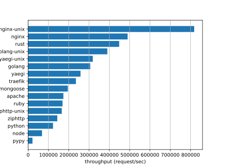
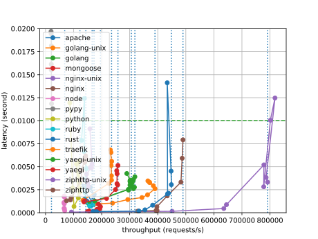

# web server microbenchmark manager

- run benchmark
    - ab, wrk, hey, etc...
- parse result
    - throughput, latency, N-percentile, etc...
- search best parameter
    - simple algorithm
    - or bayesian optimization by scikit-optimize
- summarize results
- plot graph

## prerequisite

- docker, docker compose
- task (aka go-task or taskfile.dev)

## how to run

- boot servers
    - `task prep`
- run benchmark
    - `docker compose exec client task run:list:gp`
- show results
    - `task result:barplot`
    - `task result:plot`

then we got:

- 
- 

## server setup

### nginx (C)

nginx is the most popular web servers and reverse proxies in our web universe.

configuration:

- benchmark endpoint does not do disk i/o, using builtin `empty_gif` directive
- no access log
- worker_processes = auto(default)
- worker_connections = 1024(default)

### apache httpd (C)

apache httpd is one of the most popular web servers.

configuration:

- no access log
- event mpm
- returns 200 by `RewriteRule` and `ErrorDocument`
    - without disk i/o

### traefik (golang)

traefik is a popular reverse proxy server, especially in container environments.

configuration:

- benchmark endpoint is `ping` API
    - always return 200 with "OK" string
- no access log

### ziphttp (golang)

ziphttp is a industry-leading web server for static sites. wow!!
(no, this is just something I developed for some personal web sites.)

configuration:

- serves small file in zip
- no access log

### golang

golang is one of the most popular languages for web server development.

configuration:

- implements simple endpoint
- built with PGO optimized
    - using wrk to generate PGO profile

```go
func handler(w http.ResponseWriter, r *http.Request) {
    w.WriteHeader(200)
}
```

### yaegi

yaegi is golang interpreter developed by traefik people. sometimes it is used in traefik's plugin developments.

configuration:

- boot with same source as golang server

### python/fastapi

fastapi is a popular framework for web development with Python.

configuration:

- uvicorn, installed with `uvicorn[standard]`
- no access log
- workers=8

```python
@app.get("/")
async def root():
    return {}
```

### pypy/fastapi

pypy is a Python interpreter with JIT compilation. It is generally faster than CPython.

configuration:

- uvicorn, installed with `uvicorn[standard]`
- same source as python/fastapi case
- no access log

### rust/actix-http

rust is hot language for web server developers.

configuration:

- implements simple endpoint
    - small modification from [actix-http/examples/bench.rs](https://github.com/actix/actix-web/blob/main/actix-http/examples/bench.rs)
- workers=auto(num of cores)
- no access log

```rust
    Server::build()
        .bind("test", (env::args().nth(1).unwrap(), env::args().nth(2).unwrap().parse().unwrap()), || {
            HttpService::build()
                .client_request_timeout(Duration::from_secs(1))
                .finish(|_: Request| async move {
                    Response::build(StatusCode::OK);
                    Ok::<_, Infallible>("")
                })
                .tcp()
        })?
        .workers(std::thread::available_parallelism().unwrap().get())
        .run()
        .await
```

### node

nodejs is web-native environment. usually it is used as web server to serve server-side components in some frontend framework.

configuration:

- implements simple endpoint using internal web server
- no access log

```js
const http = require("http");
const server = http.createServer((request, response) => {
  response.writeHead(200,);
  response.end("")
});
server.listen(80);
```

### mongoose (C)

mongoose is small and simple web framework for C developers.

configuration:

- implements simple endpoint
- no access log

```c
void ev_handler(struct mg_connection *c, int ev, void *ev_data) {
  if (ev == MG_EV_HTTP_MSG) {
    struct mg_http_message *hm = (struct mg_http_message *) ev_data;
    mg_http_reply(c, 200, "", "");
  }
}
```

### ruby/puma

puma is popular web server for rails developers.

- implements simple endpoint
- no access log

```ruby
app do |env|
  [200, {}, ['']]
end
```

## client setup

by default, we focus on value of 99%tile latency. if it exceed limit, discard the throughput result.

### wrk (default)

wrk is one of the best HTTP load generator.

we use these options:

| wrk option | benchmgr option |
|---|---|
| `--latency` | |
| `--threads` | `--min-depth` to 8 |
| `--connections` | `--min-depth` to `--max-depth` (target variable) |
| `--duration` | `--duration` |

### ab

ab(apache bench) is part of apache http server.

options:

| ab option | benchmgr option |
|---|---|
| `-c` | `--min-depth` to `--max-depth` (target variable) |
| `-t` | `--duration` |
| `-m` | `--method` |

### hey

hey supports HTTP/2 endpoint.

| hey option | benchmgr option |
|---|---|
| `-c` | `--min-depth` to `--max-depth` (target variable) |
| `-z` | `--duration` |
| `-m` | `--method` |

### go-wrk

go-wrk

| go-wrk option | benchmgr option |
|---|---|
| `-c` | `--min-depth` to `--max-depth` (target variable) |
| `-d` | `--duration` |
| `-M` | `--method` |

### rewrk

rewrk

| rewrk option | benchmgr option |
|---|---|
| `-c` | `--min-depth` to `--max-depth` (target variable) |
| `-d` | `--duration` |
| `--pct` | |
| `--host` | (URL argument) |
